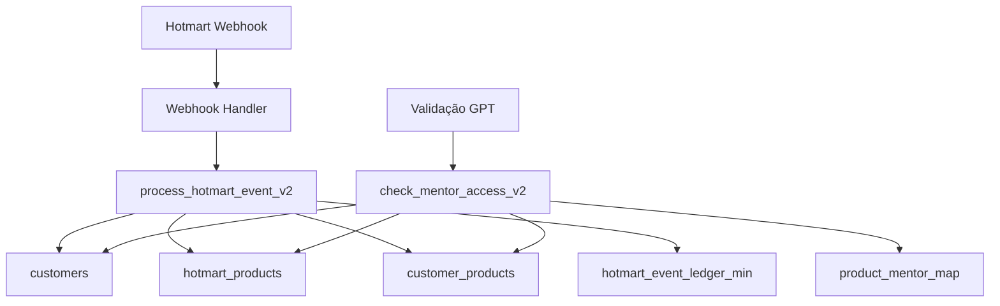

# 🔄 Resumo das Mudanças - Backend Hotmart Webhook API

## 📋 O que foi alterado

### 1. Webhook `/hotmart` (src/routes/webhooks.ts)
- ✅ **Removido**: Função `determineMentorSlugs()` com lista fixa de mentores
- ✅ **Removido**: Envio de `p_mentor_slugs` para o banco de dados
- ✅ **Adicionado**: Extração de `hotmart_product_id` e `ucode` do evento
- ✅ **Adicionado**: Suporte para `next_charge_date` na expiração
- ✅ **Atualizado**: Mapeamento de status para incluir novos valores (`PAST_DUE`, `SUSPENDED`, `TRIAL`, `UNKNOWN`)
- ✅ **Atualizado**: Chamada da nova função `process_hotmart_event_v2`

### 2. Endpoint `/access/validate` (src/routes/access.ts)
- ✅ **Removido**: Verificação de `entitlements` (modelo antigo)
- ✅ **Removido**: Consulta a tabelas `mentor_access` e `subscriptions`
- ✅ **Adicionado**: Nova lógica usando `check_mentor_access_v2`
- ✅ **Simplificado**: Fluxo direto via RPC do Supabase

### 3. Tipos TypeScript (src/types/index.ts)
- ✅ **Adicionado**: Campo `next_charge_date` na interface `subscription`
- ✅ **Atualizado**: Type `AccessStatus` com novos status

### 4. Funções SQL no Supabase
- ✅ **Criado**: `process_hotmart_event_v2()` - Processamento transacional no novo modelo
- ✅ **Criado**: `check_mentor_access_v2()` - Verificação de acesso no novo modelo

## 🎯 Novo Fluxo de Dados



## 🔧 Como usar o novo modelo

### 1. Configurar mapeamento de produtos para mentores
```sql
-- Adicionar produto na Hotmart
INSERT INTO hotmart_products (hotmart_product_id, ucode, name, status, is_subscription, active)
VALUES (12345, 'abc-123', 'Curso Completo', 'ACTIVE', false, true);

-- Mapear quais mentores este produto libera
INSERT INTO product_mentor_map (hotmart_product_id, mentor_slug) VALUES
(12345, 'java'),
(12345, 'python'),
(12345, 'react'),
(12345, 'nodejs');
```

### 2. Processar webhook (automático)
O webhook agora processa eventos e cria registros em `customer_products` sem depender de lista fixa.

### 3. Validar acesso
```http
GET /access/validate?email=cliente@example.com&mentor=java
X-API-KEY: sua-chave
```

## 📊 Vantagens do Novo Modelo

1. **Flexibilidade Total**: Adicione/remova mentores por produto sem alterar código
2. **Simplicidade**: Menos tabelas e relações complexas
3. **Performance**: Queries mais diretas e eficientes
4. **Manutenibilidade**: Lógica centralizada no banco via funções SQL
5. **Escalabilidade**: Fácil adicionar novos produtos e combinações

## 🚀 Próximos Passos

1. **Executar as migrations SQL** no Supabase
2. **Configurar mapeamentos** de produtos para mentores
3. **Testar com eventos reais** da Hotmart
4. **Monitorar logs** para validar comportamento
5. **Migrar dados antigos** se necessário

## 📁 Arquivos Criados/Alterados

### Alterados:
- `src/routes/webhooks.ts` - Webhook handler atualizado
- `src/routes/access.ts` - Endpoint de validação atualizado
- `src/types/index.ts` - Tipos TypeScript atualizados

### Criados:
- `supabase/migrations/20240219_create_process_hotmart_event_v2.sql` - Função de processamento
- `supabase/migrations/20240219_create_check_mentor_access_v2.sql` - Função de validação
- `src/test/new-model-test.ts` - Teste completo do novo modelo
- `docs/novo-modelo.md` - Documentação detalhada

O backend está pronto para o novo modelo! 🎉